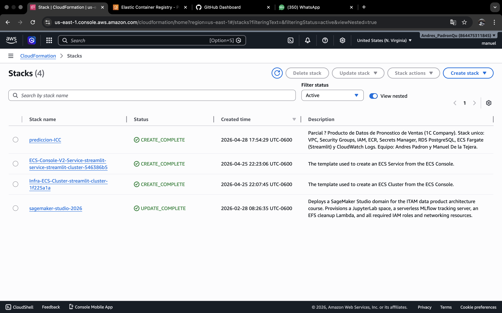
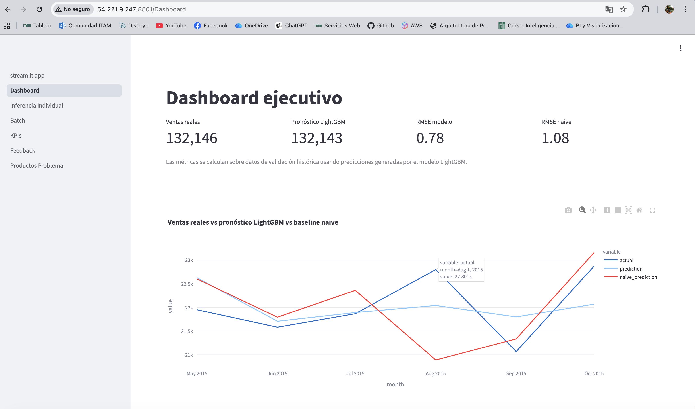
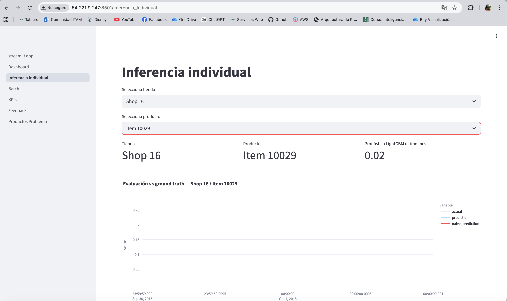
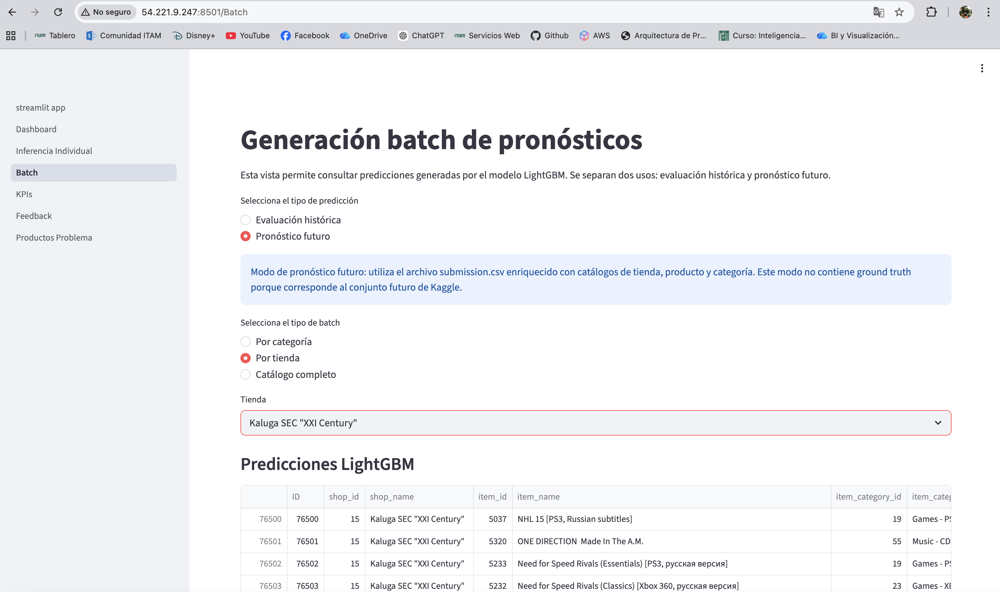
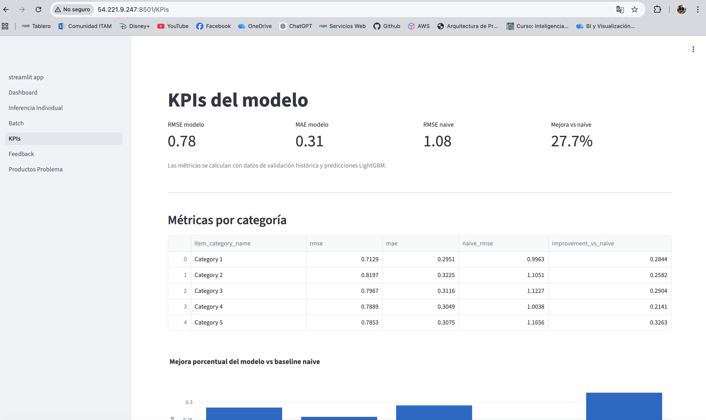
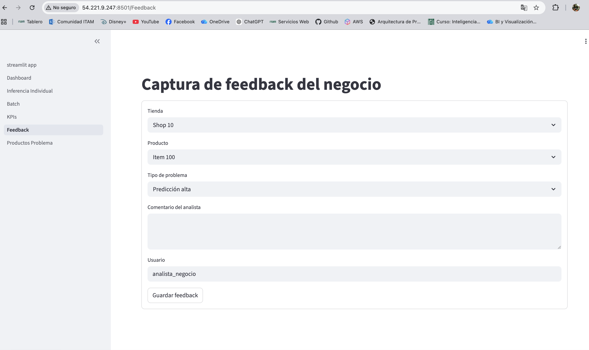
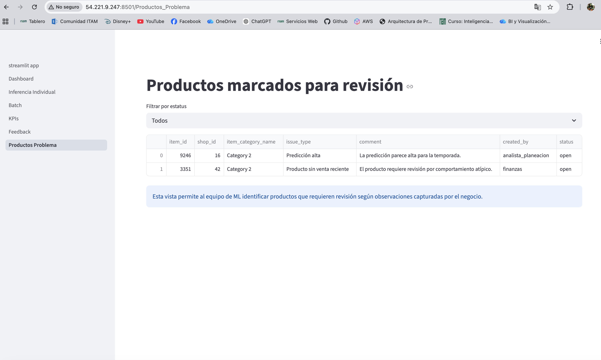

# Producto de Datos de Pronóstico de Ventas

## Proyecto realizado por Andrés Padrón y Manuel De la Tejera

## 1. Problema de negocio

El objetivo de este proyecto es construir un **producto de datos** que permita a las áreas de planeación, finanzas, BI y dirección acceder a pronósticos de ventas de manera sencilla, rápida y sin depender de notebooks o equipos técnicos.

Actualmente, el proceso de generación de pronósticos es manual, lo que limita la capacidad de reacción ante cambios en la demanda. Este proyecto propone una solución basada en la nube que habilita:

- Acceso vía interfaz web
- Consultas rápidas sobre datos históricos y predicciones
- Generación de pronósticos a nivel individual y batch
- Captura de feedback del negocio

---

## 2. Arquitectura de la solución

La solución se diseñó como un producto de datos desplegado en AWS, separando claramente las capas de aplicación, datos y machine learning.

### Componentes principales:

- **Amazon ECS (Fargate)**  
  Despliegue de la aplicación de Streamlit como interfaz web accesible vía URL pública.

- **Amazon ECR**  
  Repositorio de imágenes Docker utilizadas para contenerizar la aplicación.

- **Amazon S3**  
  Data lake donde se almacenan los datos analíticos, incluyendo:
  - datos históricos
  - predicciones
  - métricas de evaluación

- **AWS Glue Data Catalog**  
  Catálogo de metadatos que permite estructurar los datos almacenados en S3.

- **Amazon Athena**  
  Motor de consultas SQL utilizado por la aplicación para acceder a los datos en S3.

- **Amazon SageMaker**  
  Utilizado para el entrenamiento y generación de predicciones de forma offline (batch).

- **Amazon RDS (PostgreSQL)**  
  Base de datos operacional donde se almacenan:
  - feedback del negocio
  - metadatos
  - usuarios
  - logs de uso

- **AWS Secrets Manager**  
  Gestión segura de credenciales para acceder a la base de datos.

- **AWS CloudFormation**  
  Despliegue de la infraestructura como código (IaC), asegurando reproducibilidad.

### Flujo general

1. Los modelos generan predicciones en SageMaker
2. Las predicciones se almacenan en S3
3. Glue cataloga los datos
4. Athena permite consultas SQL sobre esos datos
5. La aplicación en ECS consume los datos vía Athena
6. Los usuarios interactúan con la app vía navegador
7. El feedback se almacena en RDS

---

## 3. Modelo de datos (RDS)

La base de datos relacional en RDS se diseñó para soportar la capa operacional del producto.

### Tablas principales

- **categories**
  - Catálogo de categorías de productos

- **items**
  - Información de productos
  - Relación con categorías

- **shops**
  - Información de tiendas

- **forecasts**
  - Predicciones generadas por los modelos
  - Nivel producto-tienda-mes

- **model_metrics**
  - Métricas de evaluación del modelo
  - Comparación contra baseline naive

- **business_feedback**
  - Comentarios del negocio sobre predicciones
  - Identificación de problemas

### Relaciones

- Un `item` pertenece a una `category`
- Un `item` puede tener múltiples `forecasts`
- Un `shop` puede tener múltiples `forecasts`
- Las métricas se calculan por combinación de item, shop y categoría
- El feedback del negocio se vincula a productos, tiendas y categorías

---

## 4. Aplicación

Se desarrolló una aplicación interactiva utilizando **Streamlit**, desplegada sobre AWS, que permite a usuarios de negocio consumir el producto de datos sin necesidad de conocimientos técnicos.

La aplicación está diseñada para cubrir los principales casos de uso del negocio: consulta, monitoreo, generación de pronósticos y retroalimentación.

Las predicciones mostradas en la aplicación provienen de un modelo LightGBM entrenado sobre features con lags, ejecutado mediante un pipeline reproducible de preprocessing, training e inference.

---

### Home

Pantalla principal donde se presenta el producto, su propósito y las funcionalidades disponibles.

---

### Dashboard ejecutivo

Vista agregada del desempeño del modelo, incluyendo:

- Comparación entre ventas reales y pronóstico
- Benchmark contra baseline naive
- Métricas clave (RMSE)
- Evolución temporal de las predicciones

Esta vista está orientada a perfiles directivos.

---

### Inferencia individual

Permite consultar predicciones a nivel granular:

- Selección por tienda
- Selección por producto
- Visualización de pronóstico más reciente
- Comparación contra valores reales

Esta vista permite análisis operativo detallado.

---

### Generación batch

Permite ejecutar procesos de predicción masiva:

- Por tienda
- Por categoría
- Catálogo completo

Ideal para procesos de planeación y generación de reportes.

---

### KPIs del modelo

Muestra métricas clave del modelo:

- RMSE
- MAE
- RMSE baseline naive
- Mejora porcentual

Incluye desglose por categoría para identificar áreas de mejora.

---

### Captura de feedback

Permite a usuarios de negocio capturar observaciones sobre las predicciones:

- Tipo de problema
- Comentarios
- Usuario

El feedback se almacena en RDS y puede utilizarse para mejorar el modelo.

---

### Productos problema

Listado de productos identificados como problemáticos:

- Filtrado por estatus
- Visualización de comentarios del negocio

Facilita la priorización de mejoras del modelo.

---

## 5. Despliegue en AWS (ECS + ECR + LightGBM)

Para llevar el producto a un entorno accesible para usuarios de negocio, la aplicación fue contenerizada con Docker y desplegada en AWS utilizando ECS con Fargate.

El componente central del producto de datos es un modelo de **LightGBM**, diseñado para predecir ventas mensuales a nivel producto–tienda.

---

### Características del modelo

El modelo se entrena utilizando:

- Variables históricas de ventas  
- Features con rezagos (*lags*)  
- Variables agregadas por tienda y producto  
- Componentes de estacionalidad  

---

### Pipeline de modelado

1. **Preprocessing** — limpieza de datos, generación de features, construcción de variables lag  
2. **Training** — entrenamiento del modelo LightGBM, validación temporal, evaluación con RMSE y MAE  
3. **Inference** — generación de predicciones, almacenamiento en S3  

---

### Evaluación del modelo

| Métrica | Valor |
|---------|-------|
| RMSE modelo | 0.78 |
| RMSE naive | 1.08 |
| Mejora | 27.7% |

Esto confirma que el modelo captura patrones relevantes y genera valor para el negocio.

---

### Integración en la arquitectura

**Predicción → Consumo → Feedback → Iteración**

- Predicciones almacenadas en **S3**  
- Consultas mediante **Athena**  
- Visualización en **Streamlit (ECS)**  
- Feedback almacenado en **RDS**  

---

### Cluster en ECS

Se creó un cluster en Amazon ECS llamado `streamlit-cluster`, donde se ejecuta el servicio de la aplicación.

---

### Servicio y tareas desplegadas

Dentro del cluster se desplegó el servicio con una tarea activa corriendo de forma continua en Fargate.

---

### Configuración de red

El contenedor se ejecuta con IP pública, permitiendo el acceso directo vía navegador al puerto `8501`.

---

### Logs del contenedor

Los logs del contenedor se visualizan directamente desde CloudWatch Logs para diagnóstico y monitoreo.

---

### Registro de imágenes en ECR

La imagen Docker de la aplicación fue construida y subida a Amazon ECR.

---

### CloudFormation — infraestructura como código

Toda la infraestructura fue desplegada mediante CloudFormation en estado `CREATE_COMPLETE`.

---

### Aplicación desplegada

**IP Pública:** http://54.221.9.247:8501/

#### Dashboard ejecutivo

---

#### Inferencia individual

---

#### Generación batch

---

#### KPIs del modelo

---

#### Captura de feedback

---

#### Productos marcados para revisión

---

Este enfoque convierte al modelo en un componente productivo dentro de un sistema de negocio, permitiendo su uso continuo, monitoreo y mejora basada en retroalimentación real.