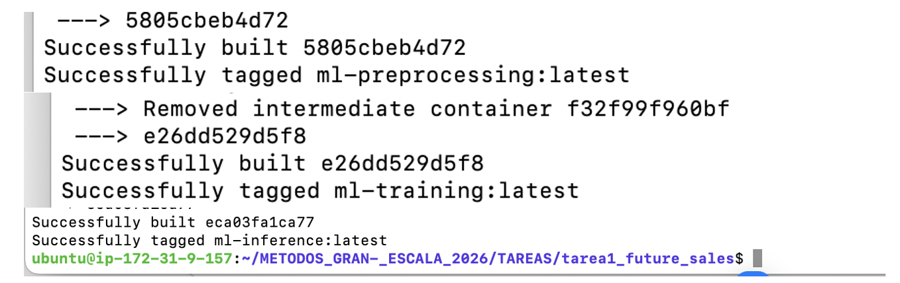
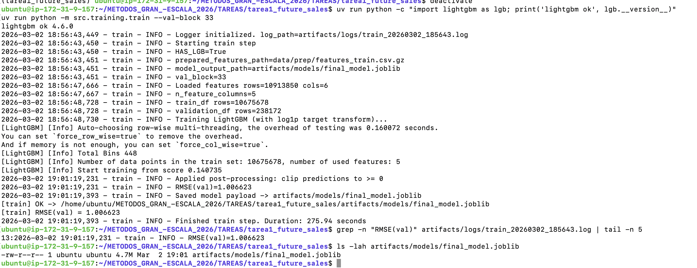
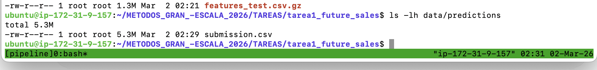
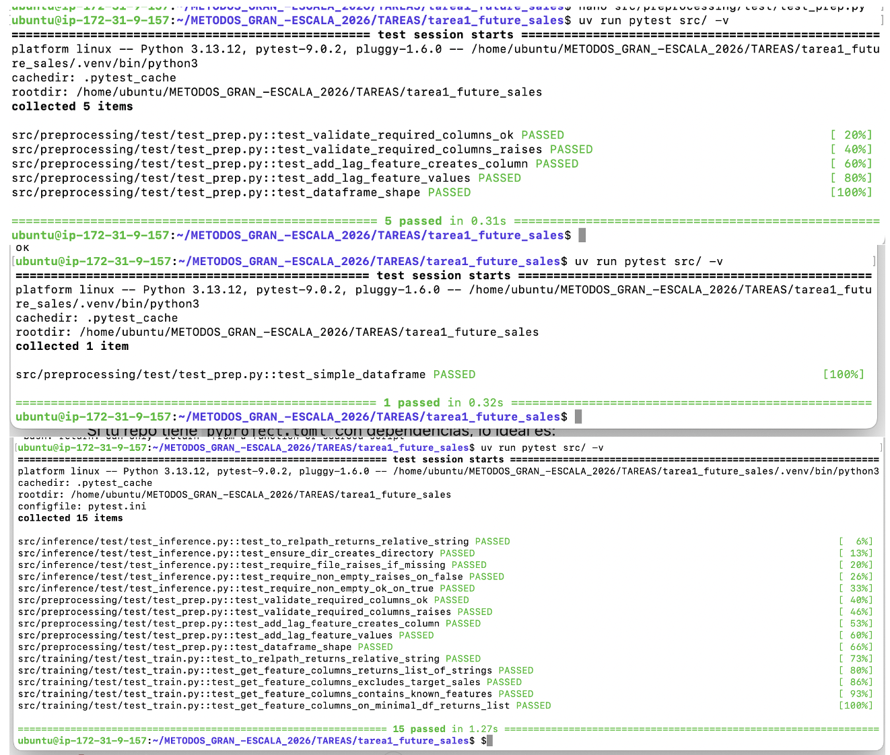

# Predict Future Sales (Kaggle) — Production-Ready ML Pipeline

Este repositorio implementa un pipeline reproducible para el reto **Predict Future Sales** de Kaggle. El objetivo es transformar datos de ventas diarias a un dataset mensual, construir *features* (incluyendo *lags*), entrenar un modelo de regresión y generar un archivo de **submission** con el formato requerido por Kaggle.

El proyecto está estructurado como un paquete de Python (`src/`) con scripts modulares para **preprocesamiento**, **entrenamiento** e **inferencia**, siguiendo buenas prácticas de ingeniería: rutas robustas con `pathlib`, validaciones explícitas, logging estructurado y artefactos versionables mediante un flujo claro.

---

## Estructura del repositorio

> Generado con `tree -a -L 3`

```text
tarea1_future_sales/
├── artifacts/
│   ├── models/
│   │   └── final_model.joblib
│   └── logs/
├── data/
│   ├── raw/                   # input Kaggle (no se sube completo si pesa mucho)
│   ├── prep/                  # features de entrenamiento
│   ├── inference/             # features para inferencia (incluye ID)
│   └── predictions/           # submissions generadas
├── docs/
│   └── images/                # evidencias (EC2, docker build, pytest, linting)
├── src/
│   ├── preprocessing/
│   ├── training/
│   ├── inference/
│   └── utils/
├── Dockerfile.preprocess
├── Dockerfile.training
├── Dockerfile.inference
├── pytest.ini
├── pyproject.toml
├── uv.lock
└── README.md
```


## Instalación y setup

### Clonar el repositorio
```
git clone <repo_url>
cd tarea1_future_sales
```
### Preparar el ambiente con uv
```
uv venv
uv sync
```

### Quickstart (ejecución local)
```
uv sync
uv run python -m src.preprocessing.prep
uv run python -m src.training.train --val-block 33
uv run python -m src.inference.inference
```

### Git Workflow

Se utilizó el siguiente flujo de ramas:

- main

- development

- feature/<feature-name>

Buenas prácticas aplicadas:

desarrollo en ramas feature/*

Pull Requests hacia development

commits con Conventional Commits:

- feat:

- fix:

- refactor:

- test:

- docs:



## Construcción en EC2 (Docker)

### Build de imágenes
```
docker build -f Dockerfile.preprocess -t ml-preprocessing:latest .
docker build -f Dockerfile.training -t ml-training:latest .
docker build -f Dockerfile.inference -t ml-inference:latest .
```

### Step 1 — Preprocessing
```
docker run --rm \
  -v "$(pwd)/data:/app/src/data" \
  -v "$(pwd)/artifacts:/app/src/artifacts" \
  ml-preprocessing:latest
```

### Step 2 — Training
```
docker run --rm \
  -v "$(pwd)/data:/app/src/data" \
  -v "$(pwd)/artifacts:/app/src/artifacts" \
  ml-training:latest \
  --val-block 33
  
#RMSE(val)=1.006623
#Saved model payload -> artifacts/models/final_model.joblib
```

### Step 3 — Inference
```
docker run --rm \
  -v "$(pwd)/data:/app/src/data" \
  -v "$(pwd)/artifacts:/app/src/artifacts" \
  ml-inference:latest
```
```
# data/predictions/submission.csv
```



## Resultados

- RMSE (validación local, val_block=33): 1.006623

- Modelo final: LightGBM + log1p + clipping

- Artefacto generado: artifacts/models/final_model.joblib

## Pruebas unitarias

```
uv run pytest src/ -v
```

Salida esperada: 15 passed

