# Producto de Datos de Pronóstico de Ventas

## 1. Problema de negocio

El objetivo de este proyecto es construir un **producto de datos** que permita a las áreas de planeación, finanzas, BI y dirección acceder a pronósticos de ventas de manera sencilla, rápida y sin depender de notebooks o equipos técnicos.

Actualmente, el proceso de generación de pronósticos es manual, lo que limita la capacidad de reacción ante cambios en la demanda. Este proyecto propone una solución basada en la nube que habilita:

- Acceso vía interfaz web
- Consultas rápidas sobre datos históricos y predicciones
- Generación de pronósticos a nivel individual y batch
- Captura de feedback del negocio

---

## 2. Arquitectura de la solución


La solución se diseñó como un producto de datos desplegado en AWS, separando claramente las capas de aplicación, datos y machine learning.

### Componentes principales:

- **Amazon ECS (Fargate)**  
  Despliegue de la aplicación de Streamlit como interfaz web accesible vía URL pública.

- **Amazon ECR**  
  Repositorio de imágenes Docker utilizadas para contenerizar la aplicación.

- **Amazon S3**  
  Data lake donde se almacenan los datos analíticos, incluyendo:
  - datos históricos
  - predicciones
  - métricas de evaluación

- **AWS Glue Data Catalog**  
  Catálogo de metadatos que permite estructurar los datos almacenados en S3.

- **Amazon Athena**  
  Motor de consultas SQL utilizado por la aplicación para acceder a los datos en S3.

- **Amazon SageMaker**  
  Utilizado para el entrenamiento y generación de predicciones de forma offline (batch).

- **Amazon RDS (PostgreSQL)**  
  Base de datos operacional donde se almacenan:
  - feedback del negocio
  - metadatos
  - usuarios
  - logs de uso

- **AWS Secrets Manager**  
  Gestión segura de credenciales para acceder a la base de datos.

- **AWS CloudFormation**  
  Despliegue de la infraestructura como código (IaC), asegurando reproducibilidad.

### Flujo general

1. Los modelos generan predicciones en SageMaker
2. Las predicciones se almacenan en S3
3. Glue cataloga los datos
4. Athena permite consultas SQL sobre esos datos
5. La aplicación en ECS consume los datos vía Athena
6. Los usuarios interactúan con la app vía navegador
7. El feedback se almacena en RDS

---

## 3. Modelo de datos (RDS)


La base de datos relacional en RDS se diseñó para soportar la capa operacional del producto.

### Tablas principales

- **categories**
  - Catálogo de categorías de productos

- **items**
  - Información de productos
  - Relación con categorías

- **shops**
  - Información de tiendas

- **forecasts**
  - Predicciones generadas por los modelos
  - Nivel producto-tienda-mes

- **model_metrics**
  - Métricas de evaluación del modelo
  - Comparación contra baseline naive

- **business_feedback**
  - Comentarios del negocio sobre predicciones
  - Identificación de problemas

### Relaciones

- Un `item` pertenece a una `category`
- Un `item` puede tener múltiples `forecasts`
- Un `shop` puede tener múltiples `forecasts`
- Las métricas se calculan por combinación de item, shop y categoría
- El feedback del negocio se vincula a productos, tiendas y categorías

---


----------------------------------------------------------------------------
# Predict Future Sales (Kaggle) — Production-Ready ML Pipeline

Este repositorio implementa un pipeline reproducible para el reto **Predict Future Sales** de Kaggle. El objetivo es transformar datos de ventas diarias a un dataset mensual, construir *features* (incluyendo *lags*), entrenar un modelo de regresión y generar un archivo de **submission** con el formato requerido por Kaggle.

El proyecto está estructurado como un paquete de Python (`src/`) con scripts modulares para **preprocesamiento**, **entrenamiento** e **inferencia**, siguiendo buenas prácticas de ingeniería: rutas robustas con `pathlib`, validaciones explícitas, logging estructurado y artefactos versionables mediante un flujo claro.

---

## Estructura del repositorio

> Generado con `tree -a -L 3`

```text
tarea1_future_sales/
├── artifacts/
│   ├── models/
│   │   └── final_model.joblib
│   └── logs/
├── data/
│   ├── raw/                   # input Kaggle (no se sube completo si pesa mucho)
│   ├── prep/                  # features de entrenamiento
│   ├── inference/             # features para inferencia (incluye ID)
│   └── predictions/           # submissions generadas
├── docs/
│   └── images/                # evidencias (EC2, docker build, pytest, linting)
├── src/
│   ├── preprocessing/
│   ├── training/
│   ├── inference/
│   └── utils/
├── Dockerfile.preprocess
├── Dockerfile.training
├── Dockerfile.inference
├── pytest.ini
├── pyproject.toml
├── uv.lock
└── README.md
```


## Instalación y setup

### Clonar el repositorio
```
git clone <repo_url>
cd tarea1_future_sales
```
### Preparar el ambiente con uv
```
uv venv
uv sync
```

### Quickstart (ejecución local)
```
uv sync
uv run python -m src.preprocessing.prep
uv run python -m src.training.train --val-block 33
uv run python -m src.inference.inference
```

### Git Workflow

Se utilizó el siguiente flujo de ramas:

- main

- development

- feature/<feature-name>

Buenas prácticas aplicadas:

desarrollo en ramas feature/*

Pull Requests hacia development

commits con Conventional Commits:

- feat:

- fix:

- refactor:

- test:

- docs:


## Construcción en EC2 (Docker)

### Build de imágenes
```
docker build -f Dockerfile.preprocess -t ml-preprocessing:latest .
docker build -f Dockerfile.training -t ml-training:latest .
docker build -f Dockerfile.inference -t ml-inference:latest .
```

### Step 1 — Preprocessing
```
docker run --rm \
  -v "$(pwd)/data:/app/src/data" \
  -v "$(pwd)/artifacts:/app/src/artifacts" \
  ml-preprocessing:latest
```

### Step 2 — Training
```
docker run --rm \
  -v "$(pwd)/data:/app/src/data" \
  -v "$(pwd)/artifacts:/app/src/artifacts" \
  ml-training:latest \
  --val-block 33
  
#RMSE(val)=1.006623
#Saved model payload -> artifacts/models/final_model.joblib
```

### Step 3 — Inference
```
docker run --rm \
  -v "$(pwd)/data:/app/src/data" \
  -v "$(pwd)/artifacts:/app/src/artifacts" \
  ml-inference:latest
```
```
# data/predictions/submission.csv
```


### Linting

#### Ruff
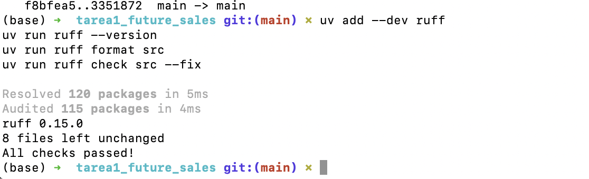

#### Pylint
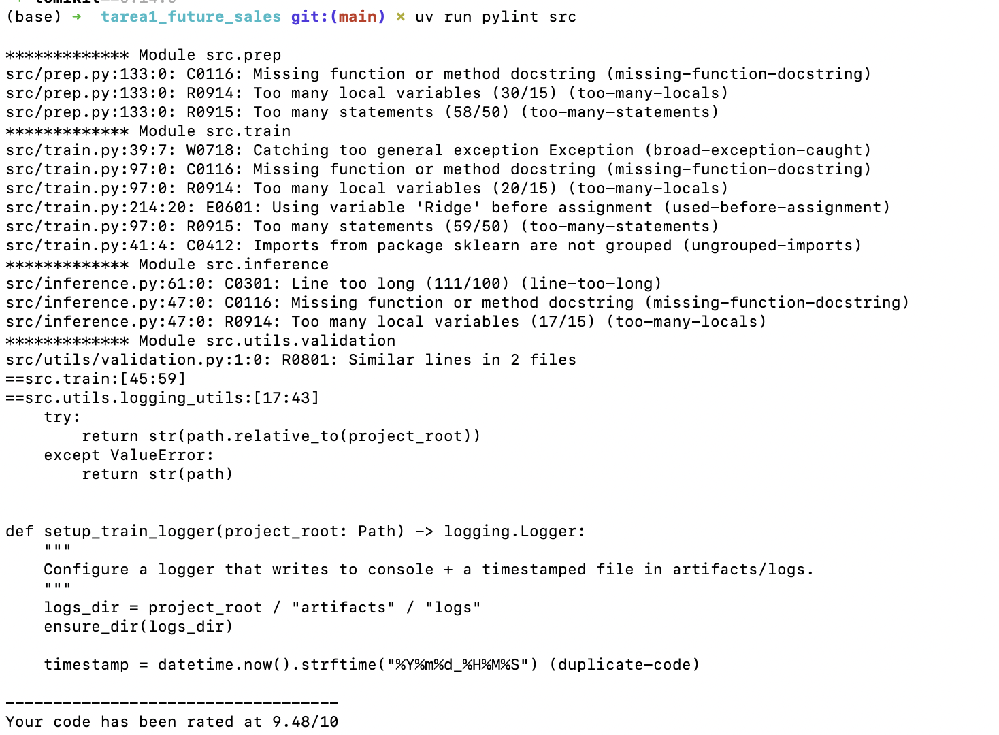

## Resultados

- RMSE (validación local, val_block=33): 1.006623

- Modelo final: LightGBM + log1p + clipping

- Artefacto generado: artifacts/models/final_model.joblib

## Pruebas unitarias

```
uv run pytest src/ -v
```

Salida esperada: 15 passed


## Entrenamiento e Inferencia con SageMaker (BYOC)

Como parte del flujo de MLOps del proyecto, se extendió el pipeline para soportar un proceso completo de **Amazon SageMaker utilizando Bring Your Own Container (BYOC)** para entrenamiento y despliegue de inferencia en tiempo real.

### Flujo de trabajo en SageMaker

El flujo seguido en SageMaker fue el siguiente:

1. Construir una imagen Docker personalizada que contiene la lógica de entrenamiento e inferencia.
2. Subir la imagen a **Amazon Elastic Container Registry (ECR)**.
3. Lanzar un **SageMaker Training Job** utilizando la imagen personalizada.
4. Entrenar un modelo **LightGBM** con el dataset de features generado previamente.
5. Guardar el artefacto del modelo en **Amazon S3**.
6. Desplegar el modelo en un **endpoint de inferencia en tiempo real** en SageMaker.
7. Enviar solicitudes de predicción en formato JSON y obtener las predicciones del modelo.

### Componentes personalizados de SageMaker

Para habilitar el entrenamiento y la inferencia en SageMaker se añadieron los siguientes componentes al proyecto:

```text
sagemaker/
├── docker/
│   └── Dockerfile
└── code/
    ├── entrypoint.sh
    ├── train.py
    ├── serve.py
    └── predictor.py
```


Estos archivos permiten que SageMaker ejecute correctamente los procesos de training y serving dentro del contenedor.

###Entrenamiento en SageMaker

El modelo fue entrenado exitosamente en SageMaker utilizando el contenedor personalizado.

Resumen del entrenamiento:

- Modelo: LightGBM

- Filas de entrenamiento: 10,675,678

- Filas de validación: 238,172

- Número de features: 7

- RMSE de validación: 0.970578

El artefacto entrenado se guarda dentro del contenedor en la ruta:

```
/opt/ml/model/final_model.joblib
```

Posteriormente SageMaker lo sube automáticamente a Amazon S3 como artefacto del entrenamiento.

### Endpoint de inferencia en tiempo real

Una vez finalizado el entrenamiento, el modelo fue desplegado en un endpoint de inferencia en tiempo real en SageMaker.

Ejemplo de payload enviado al endpoint:

```
payload = {
    "instances": [
        {
            "date_block_num": 33,
            "shop_id": 59,
            "item_id": 5037,
            "item_category_id": 19,
            "item_cnt_month_lag_1": 1.0,
            "item_cnt_month_lag_2": 0.0,
            "item_cnt_month_lag_3": 0.0
        }
    ]
}
```

Ejemplo de predicción devuelta por el endpoint:

```
{'predictions': [0.48299161640458155]}
```

### Servicios de AWS utilizados

Durante la implementación se utilizaron los siguientes servicios de AWS:

Amazon SageMaker para entrenamiento y despliegue del modelo

Amazon ECR para almacenar la imagen Docker personalizada

Amazon S3 para almacenar datos de entrenamiento y artefactos del modelo

Docker para empaquetar el entorno de entrenamiento e inferencia

### Evidencia del despliegue

En esta sección se pueden incluir capturas de pantalla que demuestren el funcionamiento del pipeline en AWS, por ejemplo:

Repositorio de imágenes en Amazon ECR

Training Job completado en SageMaker

Endpoint activo en SageMaker

Resultado de una predicción desde el notebook

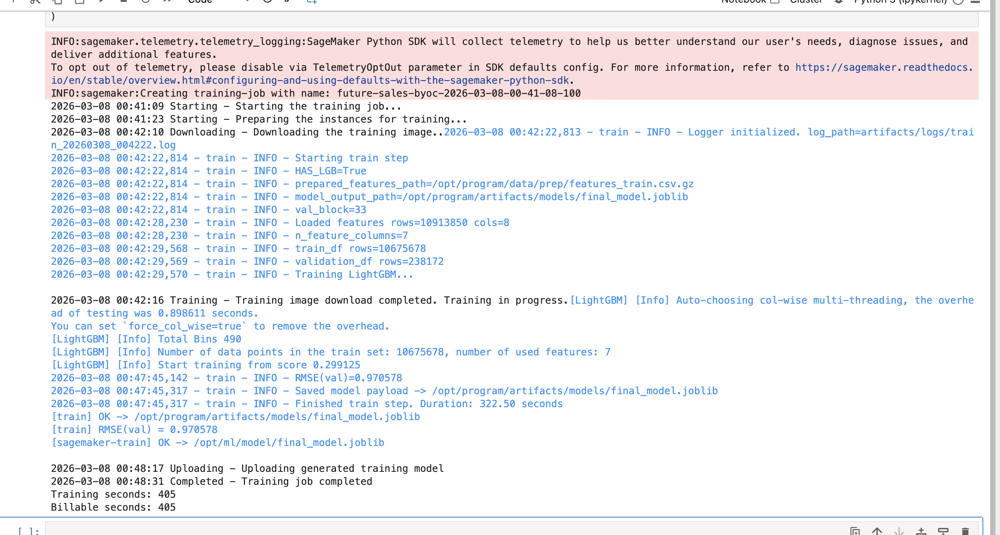

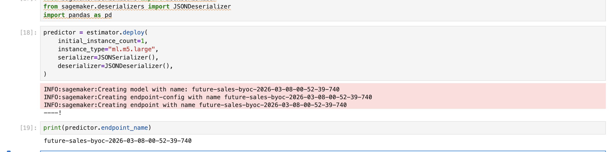

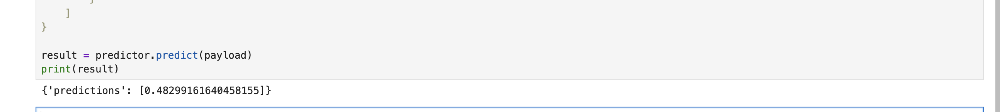

----
# SageMaker Processing Job (Preprocessing BYOC)

Además del entrenamiento y despliegue del modelo, se implementó una etapa adicional del pipeline utilizando **Amazon SageMaker Processing** con un contenedor personalizado (BYOC) para ejecutar el proceso de **preprocesamiento de datos a gran escala**.

Este componente permite ejecutar el pipeline de preparación de datos directamente en infraestructura administrada por SageMaker.

## Flujo de procesamiento

El flujo de ejecución del procesamiento es el siguiente:

```
S3 input → /opt/ml/processing/input → preprocess.py → /opt/ml/processing/output → S3 output
```

El contenedor ejecuta el script `preprocess.py`, el cual:

1. Carga el dataset de features desde S3
2. Construye las particiones de entrenamiento
3. Genera los conjuntos:

- train.csv
- validation.csv
- test.csv
- submission_features.csv

4. Guarda los resultados en `/opt/ml/processing/output`
5. SageMaker automáticamente sincroniza estos archivos con **Amazon S3**

---

# Construcción del contenedor de procesamiento

Se creó un contenedor Docker específico para ejecutar el preprocessing dentro de SageMaker.

## Login a Amazon ECR

Autenticación exitosa contra el repositorio de contenedores.

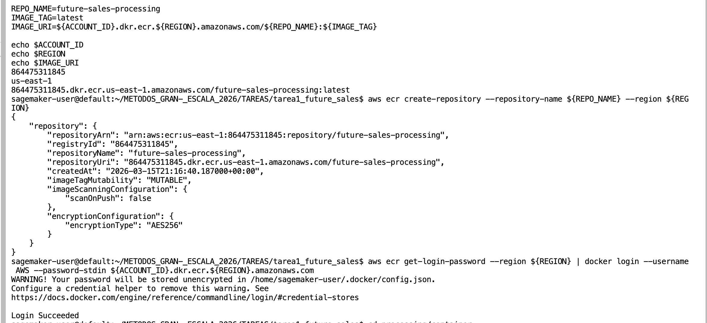

---


## Push de la imagen a Amazon ECR

La imagen se etiquetó y se subió al repositorio:

```
<account-id>.dkr.ecr.us-east-1.amazonaws.com/future-sales-processing:latest
```

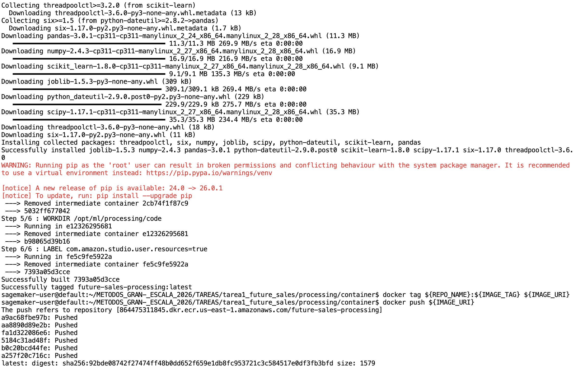

---

# Ejecución del SageMaker Processing Job

Una vez subida la imagen a ECR, se lanzó un **SageMaker Processing Job** que ejecuta el script `preprocess.py` dentro del contenedor.

Durante la ejecución se registran logs que muestran:

- carga del dataset
- construcción de particiones
- generación de archivos finales

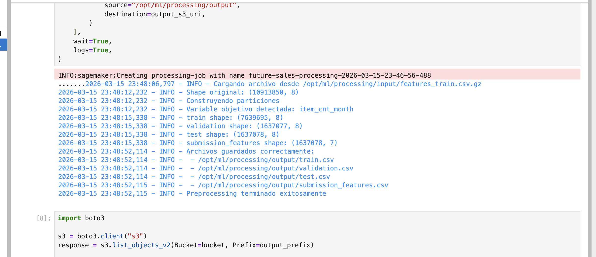

---

# Archivos generados en S3

El procesamiento generó exitosamente los siguientes datasets:

- `train.csv`
- `validation.csv`
- `test.csv`
- `submission_features.csv`

Estos archivos se almacenan automáticamente en **Amazon S3** en el prefijo de salida del Processing Job.

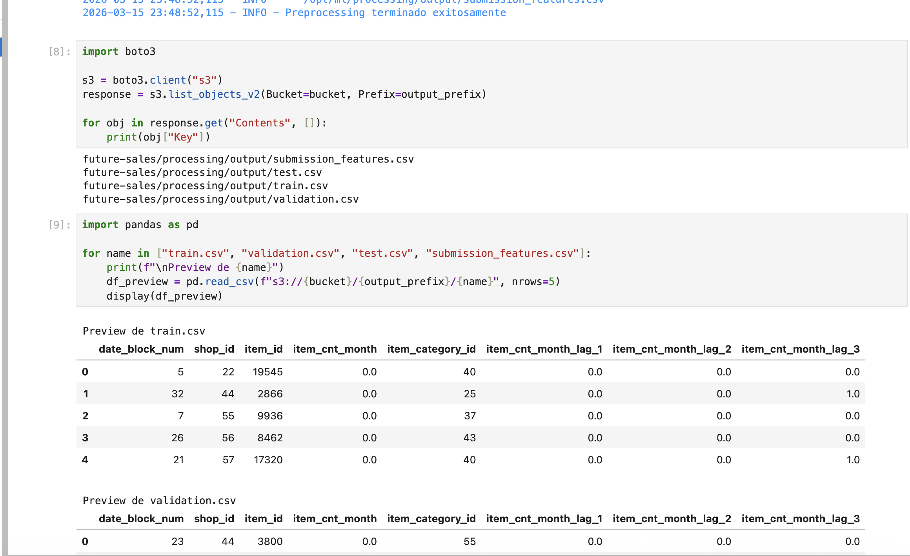

---

# Validación de los datos generados

Desde el notebook de SageMaker se verificó la existencia de los archivos en S3 y se cargaron previews de los datasets para validar su estructura.

Esto confirma que el **pipeline de preprocessing funciona correctamente en infraestructura SageMaker**.

----

## SageMaker Pipeline Execution

Se ejecutó exitosamente un pipeline de Machine Learning en Amazon SageMaker que integra las etapas de preprocesamiento, entrenamiento, evaluación, registro del modelo y batch inference.

El pipeline completo incluye los siguientes pasos:

- PreprocessStep: transformación y limpieza de datos  
- TrainStep: entrenamiento del modelo  
- EvaluateStep: evaluación del desempeño  
- CheckRMSE: validación del error (condición)  
- CreateModelStep: creación del modelo en SageMaker  
- RegisterModelStep: registro en Model Registry  
- BatchTransformStep: inferencia en batch  

Todos los pasos fueron ejecutados correctamente, alcanzando estado `Succeeded`.

### Pipeline status

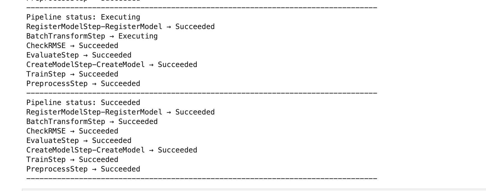

### Pipeline DAG (workflow)

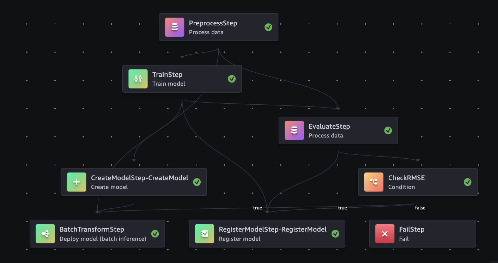

---

## Batch Inference (Predicciones en S3)

Se ejecutó un proceso de inferencia en batch mediante SageMaker, generando predicciones almacenadas en Amazon S3.

El output fue guardado en la ruta: s3://sagemaker-us-east-1-*/future-sales/batch-output/

## Model Registry

El modelo entrenado fue registrado exitosamente en SageMaker Model Registry, permitiendo su versionamiento, gobernanza y despliegue controlado.

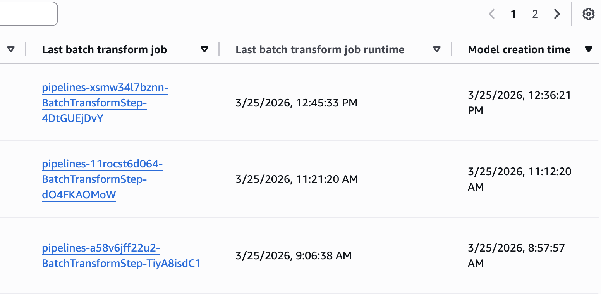

## Evaluación del modelo

El desempeño del modelo fue evaluado utilizando métricas de regresión. Los resultados se almacenaron en un archivo evaluation.json en S3.

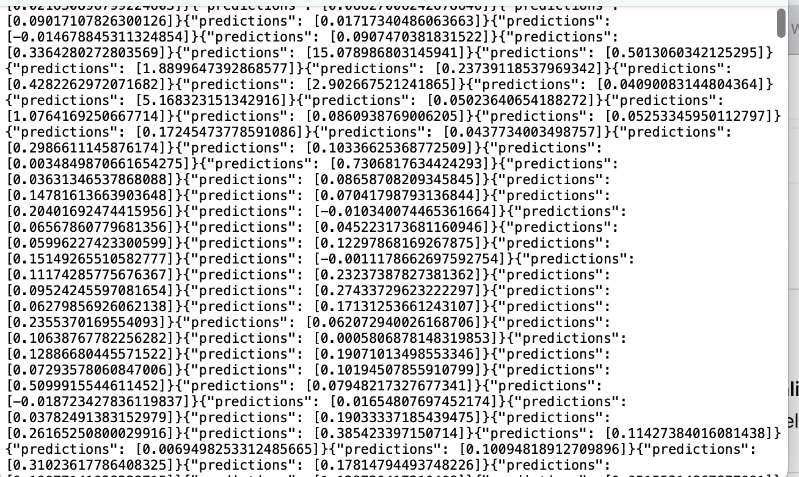


