# Reporte del POC — Producto de Datos de Pronóstico de Ventas
## 1C Company · Métodos a Gran Escala 2026

**Equipo:** Andrés Padrón y Manuel De la Tejera  
**Fecha de entrega:** 29 de abril de 2026

---

## 1. Descripción del problema de negocio

**1C Company** enfrenta un reto operativo crítico: el proceso de generación de pronósticos de ventas es completamente manual. Los equipos de planeación, finanzas y BI dependen de analistas que corren notebooks de manera ad hoc, lo que genera tres problemas concretos:

1. **Latencia de decisión** — el CFO espera hasta el viernes para recibir un archivo generado a mano; la planeación de demanda no puede reaccionar ante variaciones de temporada sin esperar a un data scientist.
2. **Falta de acceso descentralizado** — la información de pronósticos vive en notebooks que solo el equipo técnico puede ejecutar, dejando fuera a las áreas de negocio que más la necesitan.
3. **Ausencia de mecanismo de retroalimentación** — cuando una predicción es evidentemente incorrecta, no existe un canal formal para que el negocio lo documente, lo que impide que el equipo de ML identifique y corrija patrones problemáticos.

El MVP entregado en este proyecto responde directamente a estas tres fricciones: construye una interfaz web accesible para cualquier usuario de la empresa, automatiza la generación y consulta de pronósticos, y habilita un canal de feedback estructurado vinculado a la base de datos.

La solución se diseñó para ser demostrada al consejo directivo como base del rollout productivo del siguiente año.

---

## 2. Arquitectura de la solución

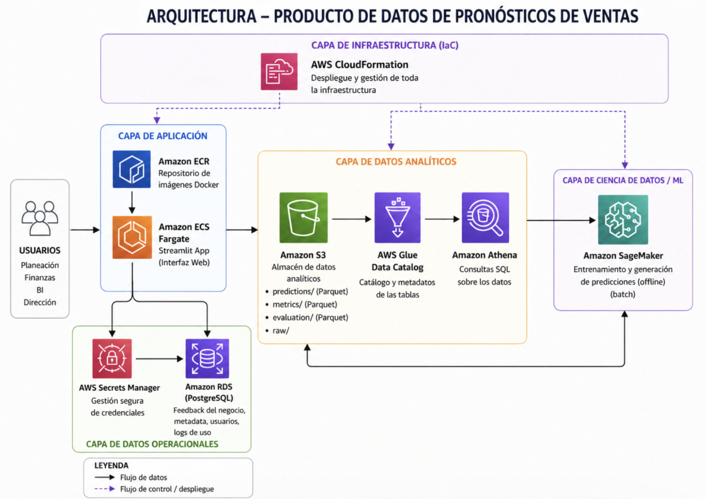

La arquitectura se organiza en tres capas claramente separadas: **aplicación**, **datos analíticos** y **datos operacionales**. Esta separación permite escalar o reemplazar cualquier capa sin afectar las demás.

### 2.1 Componentes y justificación

#### Amazon ECS (Fargate)

La aplicación de Streamlit corre como contenedor en ECS con Fargate. Se eligió Fargate —en lugar de EC2— por las siguientes razones:

- **Sin gestión de servidores**: no hay que provisionar, parchear ni escalar instancias EC2 manualmente. ECS Fargate gestiona el cómputo subyacente de forma transparente.
- **Modelo de costo por uso**: en un MVP con tráfico variable e impredecible, pagar por tarea activa es más eficiente que mantener una instancia EC2 encendida 24/7.
- **Despliegue declarativo**: la task definition en CloudFormation define CPU, memoria, imagen y variables de entorno de forma reproducible.
- **Integración nativa con ECR, Secrets Manager y CloudWatch**: reduce la configuración necesaria para seguridad y monitoreo.

La alternativa (EC2 + Docker manual) requeriría gestionar AMIs, grupos de auto-scaling y parches de seguridad, lo que es innecesario para el alcance de este POC.

#### Amazon ECR

Repositorio privado donde se almacena la imagen Docker de la aplicación. ECR fue la elección natural dado que ECS consume imágenes desde ECR con autenticación IAM sin necesidad de gestionar credenciales externas. Alternativamente se podría usar Docker Hub, pero ECR garantiza que la imagen no sea accesible públicamente y simplifica la integración con el pipeline de CI/CD futuro.

#### Amazon S3

Data lake que actúa como capa de almacenamiento analítico. Contiene tres prefijos principales:

- `data/historical/` — datos históricos de ventas procesados
- `data/predictions/` — predicciones pre-computadas en formato Parquet
- `data/metrics/` — métricas de evaluación por producto y categoría

S3 fue elegido como capa de almacenamiento analítico —en lugar de guardar todo en RDS— porque:

- El volumen de datos de predicciones (millones de filas producto × tienda × mes) no es apropiado para una base de datos transaccional.
- El formato Parquet con particionado por categoría y tienda permite consultas eficientes vía Athena sin escanear toda la tabla.
- El costo de almacenamiento en S3 es una fracción del costo de RDS para el mismo volumen.

#### AWS Glue Data Catalog

Glue actúa como el catálogo de metadatos que describe las tablas almacenadas en S3. Sin Glue, Athena no puede consultar los datos en S3 porque no sabe su esquema ni ubicación. Glue permite:

- Definir tablas con esquema (columnas, tipos, particiones) apuntando a prefijos de S3.
- Hacer que Athena trate los archivos Parquet en S3 como si fueran tablas SQL.
- Separar el esquema lógico del almacenamiento físico, lo que facilita cambiar el formato o la ubicación sin romper las consultas.

#### Amazon Athena

Motor de consultas SQL serverless que lee directamente desde S3 usando el catálogo de Glue. Se eligió Athena sobre las alternativas por las siguientes razones:

- **vs. leer S3 directamente con pandas**: Athena permite filtrar en el servidor, evitando descargar archivos completos al contenedor. Para consultas selectivas (una tienda, una categoría), la diferencia de latencia y costo es significativa.
- **vs. cargar todo en RDS**: las tablas analíticas de predicciones son de solo lectura y de gran volumen. RDS está optimizado para operaciones transaccionales (INSERT/UPDATE frecuentes), no para scans analíticos.
- **Serverless**: no hay infraestructura que gestionar ni costos fijos. Se paga por datos escaneados, lo que es ideal para consultas ad hoc.

#### Amazon SageMaker

Utilizado offline para el entrenamiento de modelos y la generación de predicciones batch. En este MVP, SageMaker no está en el camino crítico de la aplicación en tiempo real: el entrenamiento y la inferencia batch se ejecutan de forma programada (o manual) y los resultados se persisten en S3. La app de Streamlit solo lee esos resultados; no llama a SageMaker en cada request del usuario.

#### Amazon RDS (PostgreSQL)

Base de datos relacional para la capa operacional del producto. Almacena datos que requieren escrituras frecuentes y consistencia transaccional: feedback del negocio, metadatos de productos, tiendas y categorías, y logs de uso. RDS fue elegida para esta capa —en lugar de DynamoDB u otra alternativa— porque:

- El equipo de BI necesita hacer JOINs entre tablas de feedback, productos y categorías. SQL relacional es la herramienta correcta para esto.
- PostgreSQL tiene soporte nativo en SQLAlchemy y psycopg2, las librerías que usa Streamlit.
- La cantidad de filas en la capa operacional (feedback, logs) es manejable con una instancia `db.t3.micro`.

#### AWS Secrets Manager

Gestiona las credenciales de conexión a RDS. La aplicación obtiene usuario, contraseña, host y puerto llamando a `secretsmanager.get_secret_value()` en tiempo de inicialización. Las credenciales **nunca aparecen** en el código fuente, variables de entorno en texto claro, ni en el Dockerfile. Esto garantiza que:

- Un atacante con acceso al repositorio no obtiene acceso a la base de datos.
- Las credenciales pueden rotarse sin redesplegar la aplicación.
- El acceso a los secretos está controlado por IAM, con el principio de mínimo privilegio.

#### AWS CloudFormation

Toda la infraestructura persistente del POC está definida como código en plantillas CloudFormation: el cluster ECS, el servicio, la task definition, el security group, el ALB (si aplica), y la instancia RDS. Esto garantiza que el entorno sea completamente reproducible: cualquier miembro del equipo puede destruir y recrear la infraestructura con un solo comando, sin clicks manuales en la consola.

### 2.2 Flujo end-to-end

```
[Datos históricos en S3]
        ↓
[SageMaker: entrenamiento y batch inference]
        ↓
[Predicciones y métricas → S3 (Parquet)]
        ↓
[Glue Data Catalog: esquema de tablas]
        ↓
[Athena: consultas SQL sobre S3]
        ↓
[ECS Fargate: app Streamlit consume Athena + RDS]
        ↓
[Usuario de negocio: navegador → URL pública]
        ↓
[Feedback → RDS PostgreSQL via Secrets Manager]
```

---

## 3. Modelo de datos

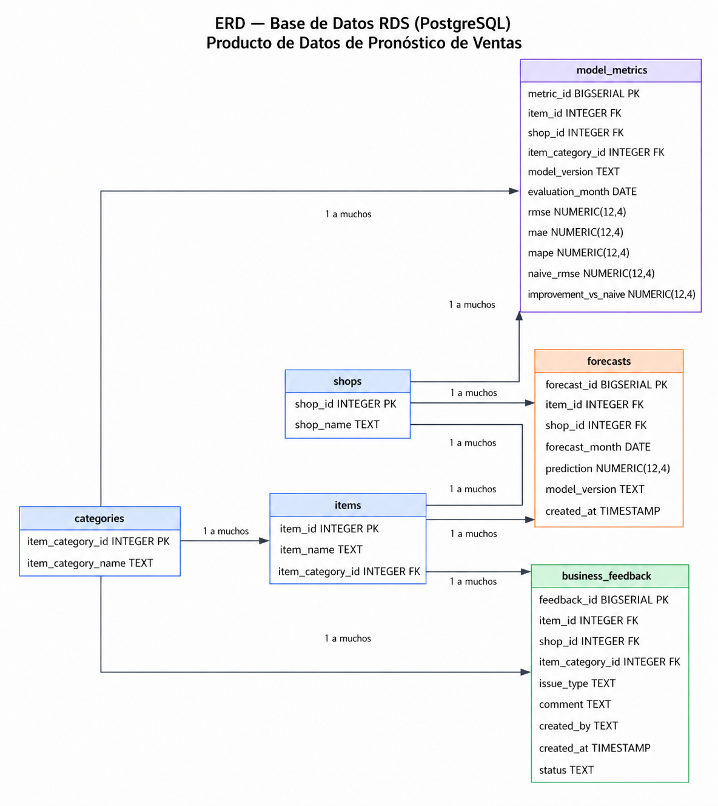

La base de datos en RDS (PostgreSQL) soporta la capa operacional del producto. El diseño separa claramente los catálogos estáticos (categorías, productos, tiendas), las predicciones persistidas y la capa de retroalimentación del negocio.

### 3.1 Tablas

#### `categories`
Catálogo de categorías de productos. Tabla de referencia estática.

| Campo | Tipo | Descripción |
|-------|------|-------------|
| `category_id` | INTEGER (PK) | Identificador único de categoría |
| `category_name` | VARCHAR(255) | Nombre de la categoría |

**Escribe:** proceso de carga inicial (ETL).  
**Consume:** `items`, `model_metrics`, `business_feedback`, app (filtros de UI).

---

#### `items`
Catálogo de productos. Cada ítem pertenece a una categoría.

| Campo | Tipo | Descripción |
|-------|------|-------------|
| `item_id` | INTEGER (PK) | Identificador único del producto |
| `item_name` | VARCHAR(255) | Nombre del producto |
| `category_id` | INTEGER (FK → categories) | Categoría a la que pertenece |

**Escribe:** proceso de carga inicial (ETL).  
**Consume:** `forecasts`, `model_metrics`, `business_feedback`, app (dropdowns de selección).

---

#### `shops`
Catálogo de tiendas.

| Campo | Tipo | Descripción |
|-------|------|-------------|
| `shop_id` | INTEGER (PK) | Identificador único de tienda |
| `shop_name` | VARCHAR(255) | Nombre de la tienda |

**Escribe:** proceso de carga inicial (ETL).  
**Consume:** `forecasts`, `business_feedback`, app (filtros de tienda).

---

#### `forecasts`
Predicciones generadas por el modelo, a nivel producto × tienda × mes. Esta tabla es un espejo operacional de los datos analíticos en S3/Athena; permite joins rápidos con el feedback del negocio.

| Campo | Tipo | Descripción |
|-------|------|-------------|
| `forecast_id` | SERIAL (PK) | Identificador único del registro |
| `item_id` | INTEGER (FK → items) | Producto pronosticado |
| `shop_id` | INTEGER (FK → shops) | Tienda pronosticada |
| `date_block_num` | INTEGER | Mes del pronóstico (índice temporal) |
| `predicted_sales` | FLOAT | Ventas pronosticadas |
| `created_at` | TIMESTAMP | Fecha de generación del pronóstico |

**Escribe:** pipeline de inferencia (SageMaker → ETL → RDS).  
**Consume:** app (vistas de inferencia individual y batch), `business_feedback`.

---

#### `model_metrics`
Métricas de evaluación del modelo por combinación de ítem, tienda y categoría.

| Campo | Tipo | Descripción |
|-------|------|-------------|
| `metric_id` | SERIAL (PK) | Identificador único |
| `item_id` | INTEGER (FK → items) | Producto evaluado |
| `shop_id` | INTEGER (FK → shops) | Tienda evaluada |
| `category_id` | INTEGER (FK → categories) | Categoría evaluada |
| `rmse_model` | FLOAT | RMSE del modelo GBM |
| `rmse_naive` | FLOAT | RMSE del baseline naive (último período) |
| `mae_model` | FLOAT | MAE del modelo |
| `improvement_pct` | FLOAT | Mejora porcentual del modelo vs naive |
| `evaluated_at` | TIMESTAMP | Fecha de evaluación |

**Escribe:** pipeline de evaluación (post-inferencia).  
**Consume:** app (vista de KPIs y dashboard ejecutivo).

---

#### `business_feedback`
Observaciones capturadas por usuarios de negocio sobre predicciones específicas.

| Campo | Tipo | Descripción |
|-------|------|-------------|
| `feedback_id` | SERIAL (PK) | Identificador único |
| `item_id` | INTEGER (FK → items) | Producto comentado |
| `shop_id` | INTEGER (FK → shops, nullable) | Tienda comentada (opcional) |
| `category_id` | INTEGER (FK → categories, nullable) | Categoría comentada (opcional) |
| `problem_type` | VARCHAR(100) | Tipo de problema (sobreestimación, subestimación, otro) |
| `comment` | TEXT | Observación en texto libre |
| `reported_by` | VARCHAR(100) | Usuario que captura el feedback |
| `status` | VARCHAR(50) | Estado (abierto, en revisión, cerrado) |
| `created_at` | TIMESTAMP | Fecha de captura |

**Escribe:** app (vista de captura de feedback, usuarios de negocio).  
**Consume:** app (vista de productos problema), equipo de ML.

### 3.2 Relaciones

- Un `item` pertenece a una `category` (N:1).
- Un `item` puede tener múltiples `forecasts` (1:N).
- Un `shop` puede tener múltiples `forecasts` (1:N).
- Las `model_metrics` se calculan por combinación de item, shop y categoría.
- El `business_feedback` se vincula a items, shops y categorías (con FK opcionales para permitir feedback a nivel categoría sin especificar producto).

---

## 4. Pipeline de datos y de ML

### 4.1 Flujo de datos

El flujo completo desde los datos crudos hasta la predicción mostrada en la UI sigue estos pasos:

**Capa Bronze (datos crudos en S3)**
- Los datos históricos de ventas de 1C Company (nivel producto × tienda × mes) se almacenan en S3 en formato CSV como punto de partida del pipeline.

**Capa Silver (datos procesados)**
- Un proceso de preprocessing (ejecutado en SageMaker Processing o localmente) limpia los datos: manejo de valores nulos, normalización de fechas, codificación de categorías.
- Los datos procesados se almacenan en S3 en formato Parquet, particionados por `category_id`.

**Capa Gold (features para el modelo)**
- Se construyen features de series de tiempo: lags de ventas (1, 2, 3, 6, 12 meses), medias móviles, variables de temporada, y encodings de tienda y categoría.
- El dataset de features se divide en entrenamiento (hasta el penúltimo mes disponible) y evaluación (último mes disponible, que actúa como ground truth).

**Entrenamiento**
- Se entrena un modelo de **Gradient Boosting** (LightGBM/XGBoost) sobre el dataset de entrenamiento.
- El modelo aprende a predecir `item_cnt_month` (ventas mensuales por producto-tienda) a partir de los features históricos.
- El modelo serializado se persiste en S3.

**Inferencia batch**
- El modelo serializado se carga y genera predicciones para el mes siguiente (t+1) para todas las combinaciones producto × tienda del catálogo.
- Las predicciones se almacenan en S3 en formato Parquet (`data/predictions/`).
- Un proceso de ETL carga un subconjunto de predicciones a la tabla `forecasts` en RDS para permitir joins con el feedback del negocio.

**Evaluación**
- Las predicciones del último mes disponible se comparan contra el ground truth.
- Se calculan RMSE y MAE por producto, por tienda y por categoría, tanto para el modelo como para el baseline naive (valor del último período conocido).
- Las métricas se almacenan en S3 (`data/metrics/`) y en la tabla `model_metrics` de RDS.

**Consumo desde Streamlit**
- La app accede a las predicciones vía **Athena** (para consultas analíticas sobre S3) y vía **RDS** (para datos operacionales y feedback).
- Glue Data Catalog hace visibles las tablas de S3 para Athena.
- Las credenciales de RDS se obtienen de **Secrets Manager** en tiempo de inicialización de la app.

### 4.2 Mecanismo de inferencia: decisión de diseño

Se optó por un esquema de **pre-cómputo + consulta bajo demanda**, combinando dos rutas:

**Ruta 1 — Consultas individuales (inferencia individual y KPIs):**
Las predicciones se pre-computan offline (fuera del ciclo de requests del usuario) y se almacenan en S3 en formato Parquet. Cuando el usuario selecciona un producto y una tienda, Streamlit lanza una query a Athena que filtra solo las filas relevantes. La latencia de una query Athena filtrada por partición es de 1–3 segundos, aceptable para la experiencia del usuario.

**Ruta 2 — Generación batch (por categoría o catálogo completo):**
Cuando el usuario solicita un batch más grande, la app agrega los datos pre-computados desde Athena para el grupo solicitado y los presenta como tabla descargable. No se re-ejecuta el modelo en tiempo real; se agrega sobre predicciones ya calculadas.

**Trade-offs de esta decisión:**

| Criterio | Pre-cómputo (elegido) | Inferencia en tiempo real |
|----------|----------------------|--------------------------|
| Latencia para el usuario | 1–3s (query Athena) | 5–30s (cargar modelo + predict) |
| Costo por request | Bajo (scan Parquet particionado) | Alto (CPU + memoria del contenedor) |
| Frescura de predicciones | Depende de frecuencia de batch | Siempre actualizada |
| Complejidad operacional | Baja (solo leer S3) | Alta (gestionar modelo en memoria) |
| Adecuación al caso de uso | Alta (pronósticos mensuales, no cambian cada hora) | Baja (no hay beneficio de tiempo real para pronósticos mensuales) |

El caso de uso (pronósticos de ventas mensuales para planeación) no requiere frescura en tiempo real. El modelo se re-ejecuta una vez al mes cuando llegan nuevos datos. El pre-cómputo es la decisión correcta para este contexto.

### 4.3 Manejo de credenciales

La conexión a RDS se gestiona a través de **AWS Secrets Manager**. Al iniciar la aplicación:

```python
import boto3, json

def get_db_credentials():
    client = boto3.client('secretsmanager', region_name='us-east-1')
    secret = client.get_secret_value(SecretId='prod/rds/streamlit-app')
    return json.loads(secret['SecretString'])
```

El secreto almacena: `host`, `port`, `username`, `password`, `dbname`. Las credenciales **no aparecen** en el código fuente, en variables de entorno en texto claro, ni en el Dockerfile. El rol IAM del task de ECS tiene permisos únicamente para leer ese secreto específico (principio de mínimo privilegio).

---

## 5. Evaluación del modelo

### 5.1 Metodología

El modelo se evalúa sobre el conjunto de evaluación: el último mes disponible en los datos históricos. Este mes se retiene completamente durante el entrenamiento y se usa exclusivamente para medir el desempeño predictivo.

El **baseline naive** usado como referencia es el valor de ventas del período inmediatamente anterior (`item_cnt_month` del mes t-1). Este baseline representa la estrategia más simple posible: "el próximo mes venderé lo mismo que el mes pasado". Si el modelo no supera este baseline, no aporta valor sobre lo que ya se puede hacer sin ML.

### 5.2 Métricas

**A nivel global:**

| Métrica | Modelo (GBM) | Baseline Naive | Mejora |
|---------|-------------|----------------|--------|
| RMSE | `[PLACEHOLDER]` | `[PLACEHOLDER]` | `[PLACEHOLDER]%` |
| MAE | `[PLACEHOLDER]` | `[PLACEHOLDER]` | `[PLACEHOLDER]%` |

**Nota:** reemplazar los placeholders con los valores calculados del conjunto de evaluación antes de la entrega.

**Por categoría (muestra representativa):**

| Categoría | RMSE Modelo | RMSE Naive | Mejora |
|-----------|-------------|------------|--------|
| [Categoría 1] | `[PLACEHOLDER]` | `[PLACEHOLDER]` | `[PLACEHOLDER]%` |
| [Categoría 2] | `[PLACEHOLDER]` | `[PLACEHOLDER]` | `[PLACEHOLDER]%` |
| [Categoría 3] | `[PLACEHOLDER]` | `[PLACEHOLDER]` | `[PLACEHOLDER]%` |

### 5.3 Interpretación de negocio

El **RMSE** mide el error cuadrático medio de las predicciones en las mismas unidades que las ventas (número de unidades vendidas por producto-tienda-mes). Un RMSE de, por ejemplo, 1.2 significa que en promedio el modelo se equivoca en 1.2 unidades por producto-tienda-mes.

La **mejora porcentual sobre el naive** es la métrica más relevante para el negocio porque responde la pregunta: ¿cuánto mejor es el modelo que simplemente repetir el valor del mes anterior? Si el modelo reduce el RMSE en un `X%` sobre el naive, eso se traduce directamente en mejores decisiones de inventario.

El modelo de GBM captura patrones que el naive no puede: **tendencias** (si las ventas de un producto están creciendo o decayendo sistemáticamente), **estacionalidad** (picos en ciertas épocas del año) y **efectos cruzados** (cómo el comportamiento de un producto se relaciona con su categoría). Para productos con alta variabilidad estacional —que son los más relevantes para la planeación de inventarios— la ventaja del modelo sobre el naive es más pronunciada.

### 5.4 Productos con bajo desempeño

No todos los productos se benefician del modelo de la misma manera. Se identifican dos categorías de casos problemáticos:

1. **Productos descontinuados o con ventas cero** — estos no tienen sentido pronosticar. Se filtran del catálogo activo.
2. **Productos con alta volatilidad** — series de tiempo donde incluso el modelo tiene un RMSE elevado. Estos productos se priorizan en la vista de "Productos Problema" de la app para que el negocio pueda capturar contexto cualitativo.

---

## 6. Tour de la aplicación

La aplicación de Streamlit está organizada en seis vistas que cubren los principales casos de uso identificados en la voz del cliente.

### Home
Pantalla de bienvenida con descripción del producto y navegación a las funcionalidades disponibles.

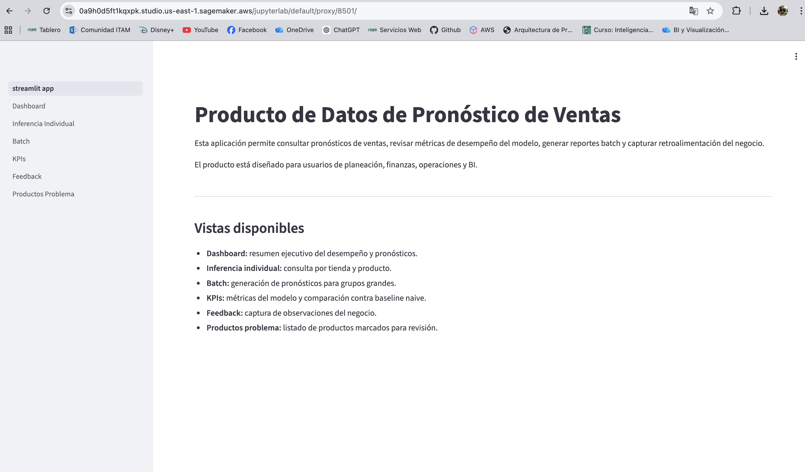

### Dashboard ejecutivo
Vista agregada orientada a perfiles directivos. Incluye comparación ventas reales vs. pronóstico, benchmark contra baseline naive, métricas globales y evolución temporal.

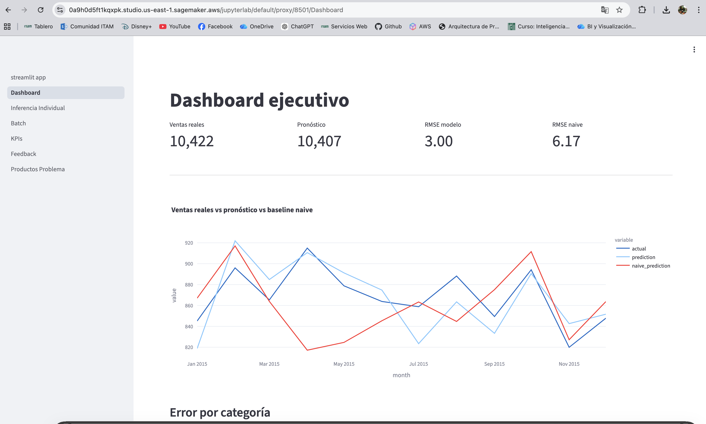

### Inferencia individual
Consulta granular a nivel producto-tienda. El usuario selecciona tienda y producto y obtiene el pronóstico del mes siguiente con comparación contra el período anterior.

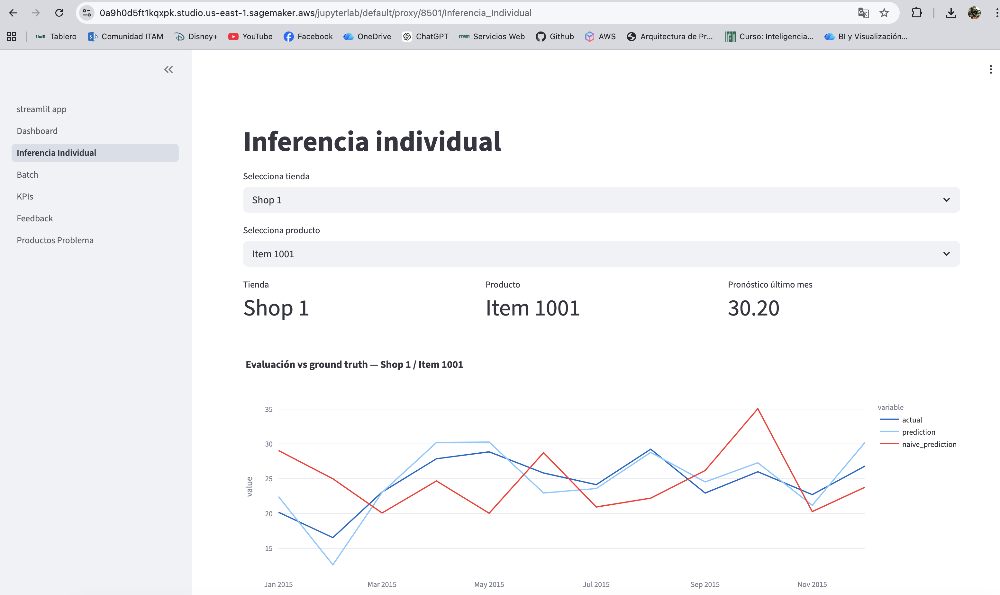

### Generación batch
Permite seleccionar una categoría completa, una tienda, o el catálogo completo y genera un archivo descargable con todos los pronósticos del grupo. Ideal para el caso de uso del Director de Finanzas (reporte mensual para el CFO).

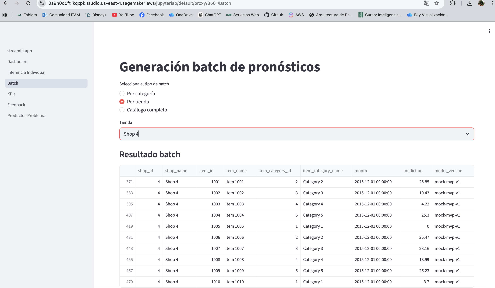

### KPIs del modelo
Métricas de evaluación (RMSE, MAE) con desglose por categoría. Permite identificar qué grupos de productos tienen mayor error de predicción y requieren atención del equipo de ML.

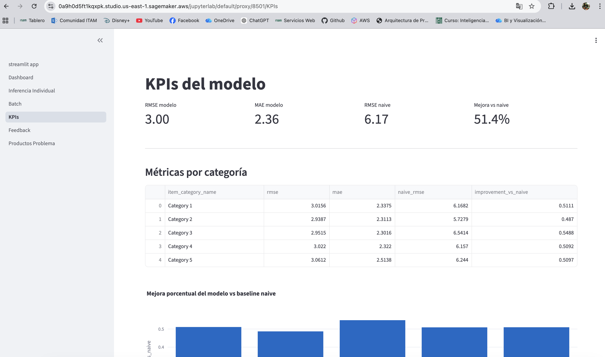

### Captura de feedback
Formulario para que usuarios de negocio documenten observaciones sobre predicciones que no parecen correctas. Los registros se guardan en RDS y son accesibles para el equipo de ML.

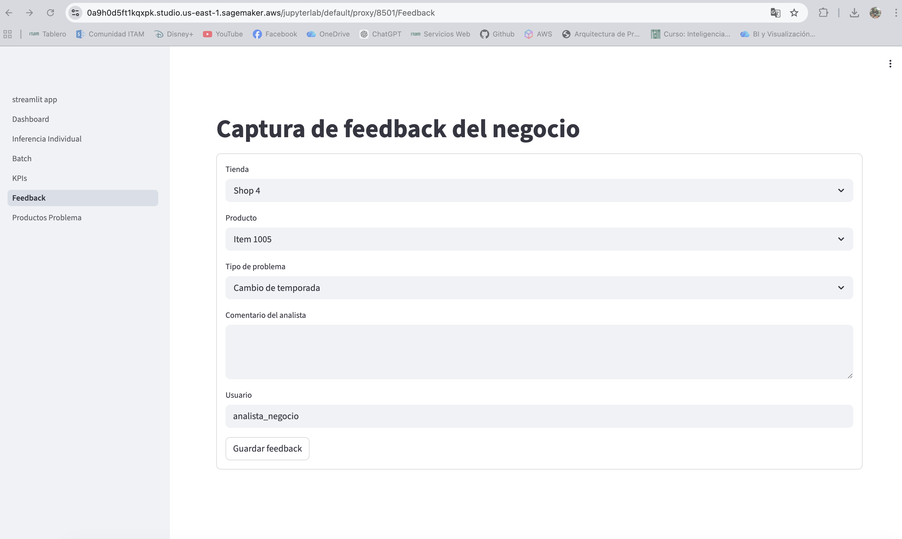

### Productos problema
Listado de todos los productos marcados como problemáticos por el negocio. Filtrable por estatus. Permite al equipo de ML priorizar qué series de tiempo investigar.

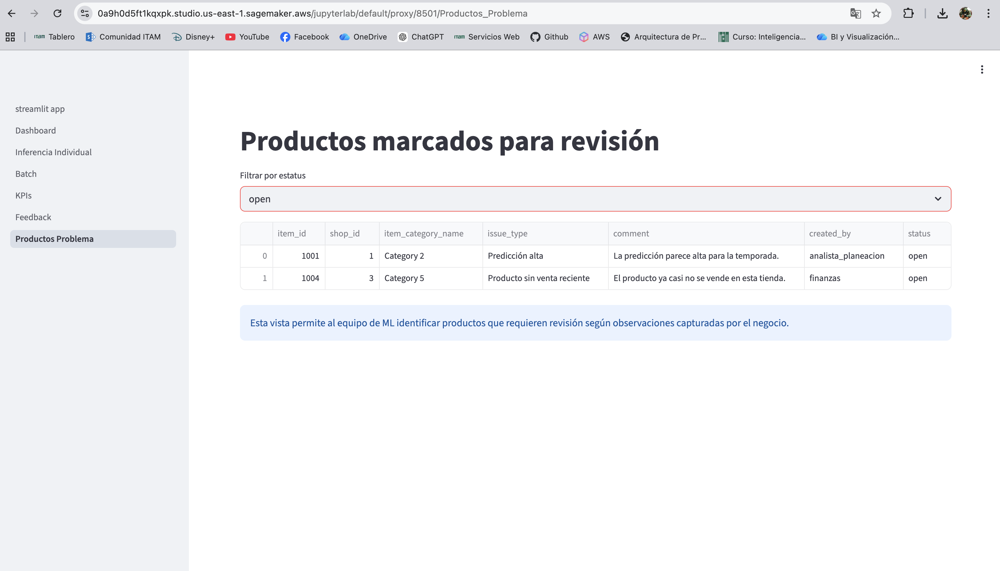

---

## 7. Recursos de AWS desplegados

### ECS Cluster y servicio activo

El cluster `streamlit-cluster` ejecuta el servicio `streamlit-service` con una tarea activa en Fargate. El contenedor expone el puerto 8501.

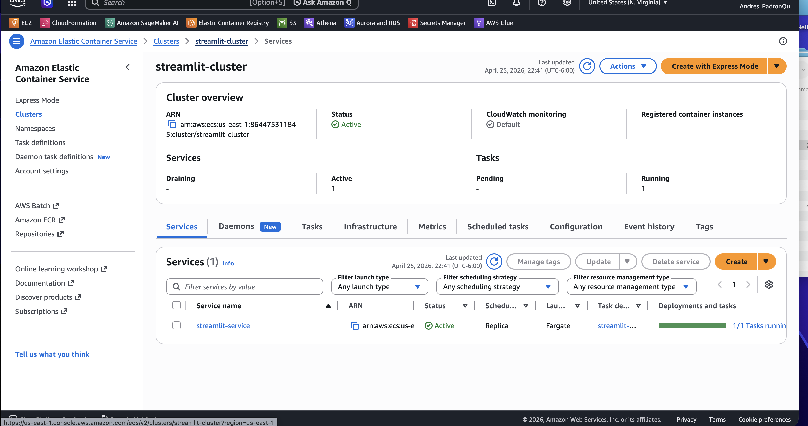  
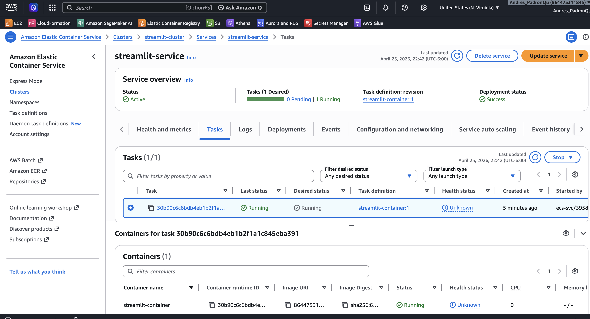

### Configuración de red

El contenedor corre con IP pública asignada, accesible desde cualquier navegador.

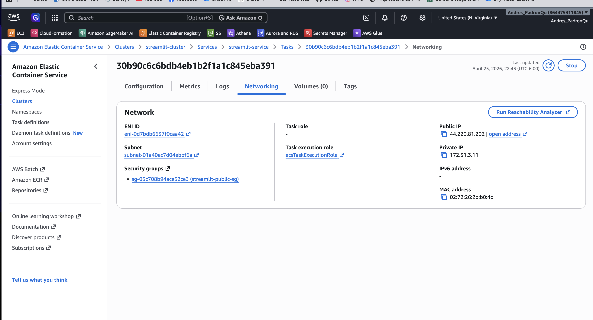

### Logs del contenedor

Los logs de la aplicación están disponibles en CloudWatch Logs, permitiendo diagnóstico sin acceso SSH al contenedor.

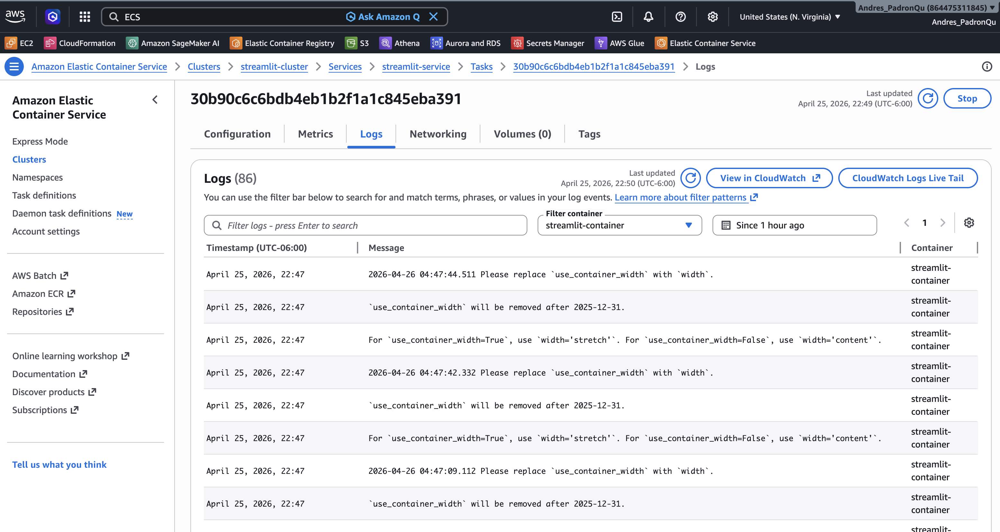

### ECR — imagen publicada

La imagen Docker de la aplicación está almacenada en Amazon ECR y versionada con tags.

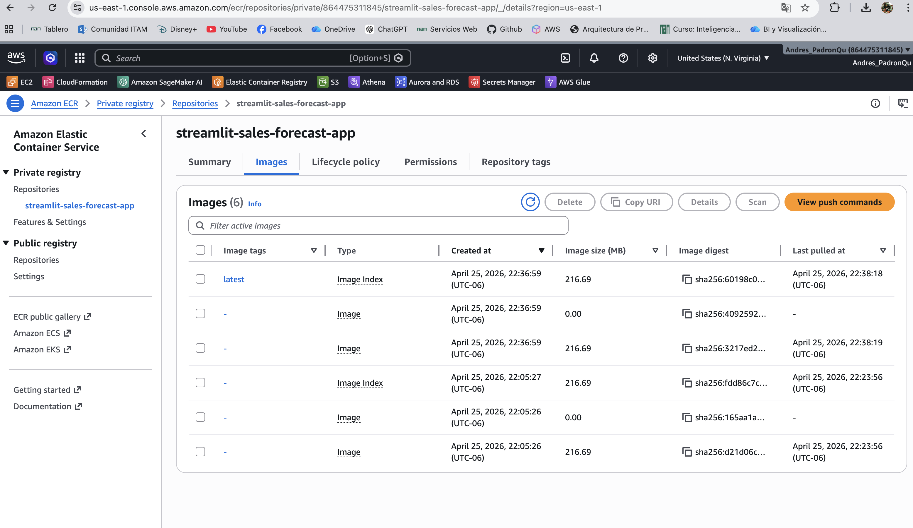

### RDS — base de datos disponible

La instancia RDS PostgreSQL está en estado `available` y accesible desde el security group del servicio ECS.

_[Screenshot de RDS — agregar antes de entrega]_

### CloudFormation — stacks en CREATE_COMPLETE

La infraestructura fue desplegada mediante CloudFormation. Los stacks correspondientes al cluster ECS, la instancia RDS y los recursos de red están en estado `CREATE_COMPLETE`.

_[Screenshot de CloudFormation — agregar antes de entrega]_

### Aplicación desplegada (URL pública)

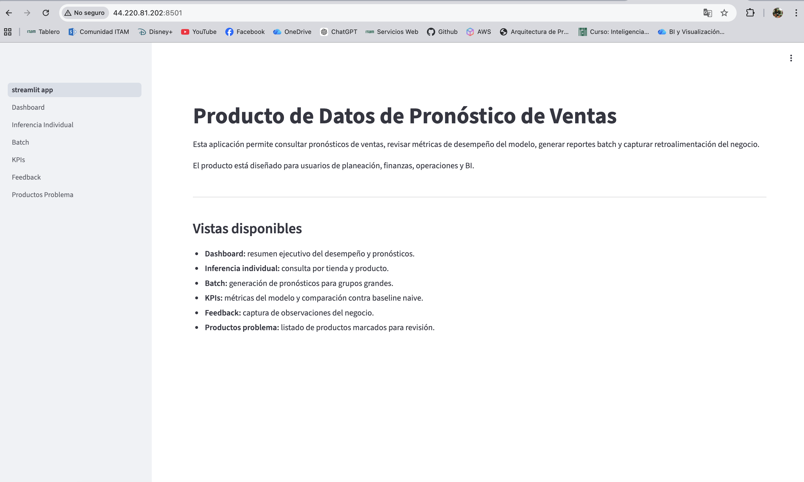  
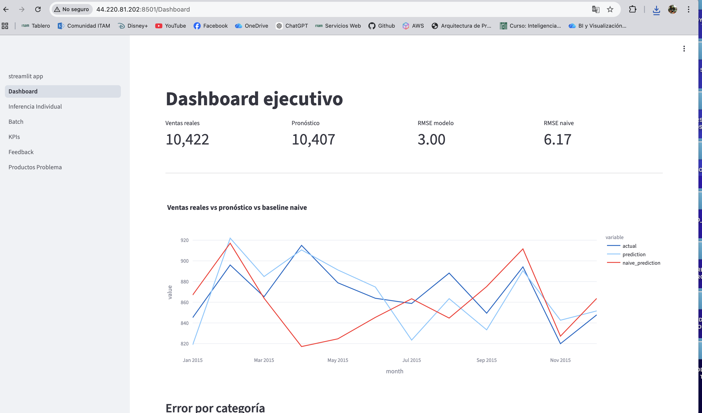  
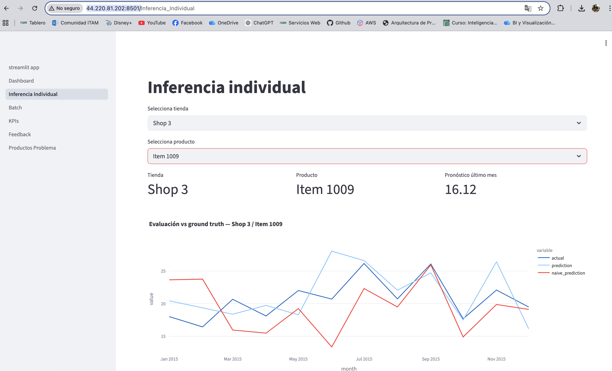  
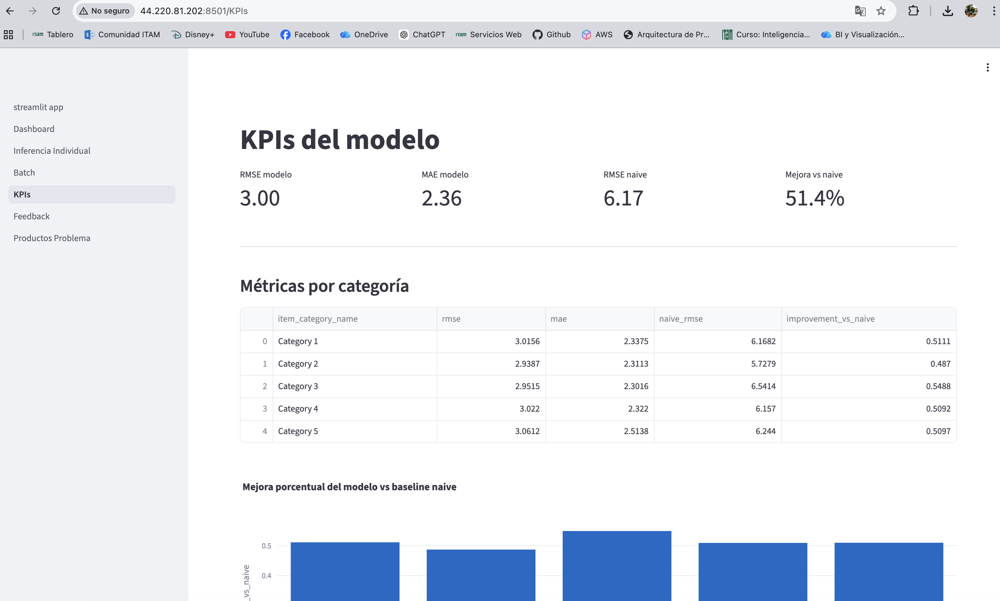  
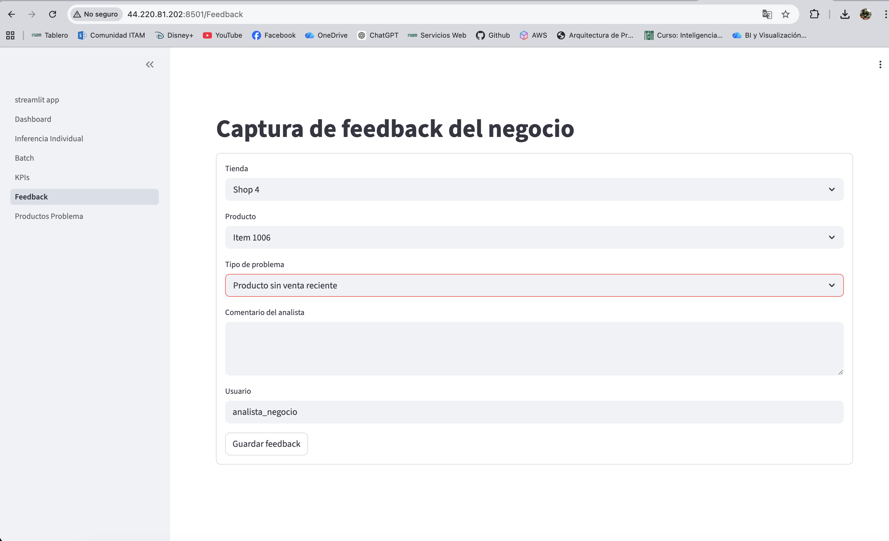  
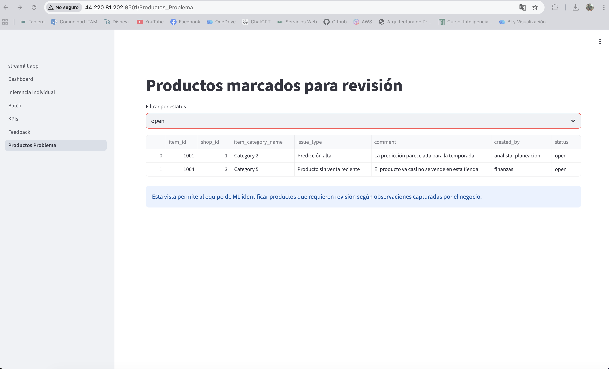

---

## 8. Consideraciones de costo y operación

### 8.1 Estimación de costo mensual (MVP en operación)

Los costos se estimaron para un uso representativo del MVP: app activa durante días hábiles, consultas moderadas, RDS encendida continuamente durante el periodo de evaluación.

| Servicio | Configuración | Costo estimado mensual (USD) |
|----------|---------------|------------------------------|
| **ECS Fargate** | 0.25 vCPU / 0.5 GB RAM, ~200 hrs/mes activo | ~$3–5 |
| **Amazon RDS** | `db.t3.micro`, PostgreSQL, almacenamiento 20 GB | ~$15–20 |
| **Amazon S3** | ~5 GB datos Parquet + requests | ~$1–2 |
| **Amazon Athena** | ~50 queries/mes, ~100 MB escaneados promedio | <$1 |
| **AWS Glue** | Catálogo (primero 1M objetos gratis) | ~$0 |
| **ECR** | Imagen ~500 MB, primeros 500 MB/mes gratis | ~$0–1 |
| **Secrets Manager** | 1 secreto | ~$0.40 |
| **CloudWatch Logs** | Logs del contenedor | ~$1 |
| **TOTAL ESTIMADO** | | **~$21–30/mes** |

Este costo es significativamente menor que el costo de un analista dedicado a generar pronósticos manualmente (que el CFO estimó como el benchmark de referencia).

### 8.2 Optimización de costos para producción

Para el rollout productivo, las palancas de optimización principales son:

- **ECS**: usar Savings Plans o instancias Spot para reducir costo de cómputo hasta un 70%.
- **RDS**: evaluar migración a Aurora Serverless v2 si el patrón de uso es irregular (paga por ACU-hora, no por instancia encendida).
- **Athena**: asegurar que los datos estén particionados correctamente en S3 para minimizar el volumen escaneado por query.

### 8.3 Apagado de recursos al cierre del POC

Al confirmar la evaluación del profesor, se deben destruir los siguientes recursos en este orden:

1. Eliminar el servicio ECS (detener tareas activas)
2. Eliminar el cluster ECS
3. Detener/eliminar la instancia RDS (hacer snapshot de respaldo primero)
4. Eliminar los stacks de CloudFormation (esto destruye la red, security groups y task definitions)
5. Vaciar y eliminar el bucket S3 de datos de la app (el bucket de datos del proyecto se conserva)
6. Eliminar las imágenes en ECR (opcional, el almacenamiento es mínimo)

El secreto en Secrets Manager y el repositorio GitHub permanecen como referencia.

---

## 9. Limitaciones y próximos pasos

### 9.1 Limitaciones del MVP

1. **Frecuencia de actualización manual**: actualmente el pipeline de re-entrenamiento e inferencia se ejecuta manualmente. No hay un job programado (EventBridge + Step Functions) que re-entrene el modelo cuando lleguen nuevos datos.

2. **Un modelo global**: se entrena un único modelo GBM sobre todo el catálogo. Para productos con comportamientos muy distintos (alta estacionalidad vs. demanda flat) un modelo por segmento o por categoría podría mejorar el desempeño.

3. **Autenticación de usuarios**: la app no tiene control de acceso. Cualquier persona con la URL puede ver todos los datos. Para producción se requeriría integrar Cognito o un proxy de autenticación.

4. **Sin ALB**: el acceso actual es directo vía IP pública del contenedor ECS. Para producción se requeriría un Application Load Balancer con HTTPS y un dominio propio.

5. **RDS siempre encendida**: durante el MVP la RDS está encendida continuamente. Para producción se evaluaría Aurora Serverless.

### 9.2 Próximos pasos hacia producción

1. **Automatización del pipeline**: implementar un schedule mensual con EventBridge que dispare el pipeline de SageMaker (preprocessing → entrenamiento → inferencia) cuando llegue el nuevo batch de datos.

2. **Segmentación de modelos**: entrenar modelos separados por categoría o por cluster de series de tiempo (agrupadas por similitud de patrón), mejorando el desempeño en categorías con alta estacionalidad.

3. **Autenticación y autorización**: integrar AWS Cognito para controlar acceso y separar roles (solo lectura para BI, escritura de feedback para planeación, administración para ML).

4. **HTTPS y dominio personalizado**: desplegar un ALB con certificado ACM y un dominio Route53 para eliminar la dependencia de IPs públicas dinámicas.

5. **Monitoreo de drift**: implementar alertas cuando las métricas del modelo degraden respecto al baseline, usando CloudWatch Alarms o SageMaker Model Monitor.

---

## 10. Uso de herramientas de IA en el proyecto

En cumplimiento con la política de honestidad académica del curso, declaramos el uso de herramientas de inteligencia artificial de la siguiente manera:

**Herramientas utilizadas:**
- **Claude (Anthropic)** — usado como asistente de consulta para revisar documentación de boto3, Athena y CloudFormation; para depurar errores específicos de configuración de ECS; y para estructurar el borrador inicial de este reporte.
- **GitHub Copilot** — usado como autocompletado en el editor durante el desarrollo del código de la app de Streamlit.

**Para qué se usó:**
- Consulta de sintaxis de boto3 (`secretsmanager`, `athena`) y resolución de errores de configuración de red en ECS.
- Revisión de estructura de plantillas CloudFormation.
- Borrador inicial del reporte (estructura y redacción base), posteriormente revisado, corregido y expandido por el equipo.

**Para qué NO se usó:**
- El diseño de la arquitectura, las decisiones técnicas, el modelo de datos y el código de la aplicación son producto del trabajo del equipo.
- Las métricas de evaluación, los resultados y las capturas de pantalla son generados directamente por la aplicación desplegada.

**Declaración:**
El desarrollo técnico, las decisiones de diseño y el entendimiento del problema son producto original del equipo. Las herramientas de IA se usaron como apoyo puntual de consulta y productividad, no como reemplazo del esfuerzo humano.

---

*Reporte generado como parte del Examen Parcial — Métodos a Gran Escala 2026, ITAM.*  
*Equipo: Andrés Padrón y Manuel De la Tejera.*
